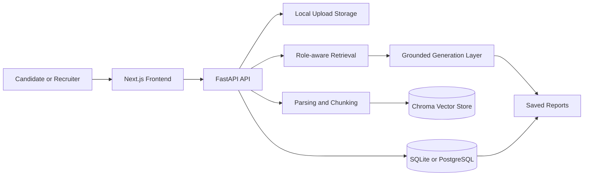

# HireLens AI

AI-powered interview and hiring intelligence platform with two roles:
- candidate interview prep
- recruiter job, candidate, and report workflows

## Project summary
HireLens AI is a full-stack RAG application built to show a realistic AI product workflow instead of a toy prompt box. It ingests CVs, job descriptions, project notes, and recruiter-side candidate materials, retrieves evidence by role-aware scope, and generates grounded outputs for two different users:
- candidates preparing for interviews
- recruiters assessing role fit and planning interviews

## Architecture summary
HireLens AI is a modular monolith:
- `frontend/`: Next.js + TypeScript + Tailwind UI
- `backend/`: FastAPI + SQLAlchemy + Alembic API
- relational data: SQLite for the easiest local MVP flow, PostgreSQL-ready for deployment
- vector retrieval: local Chroma persistence
- AI provider layer: deterministic local mode for development, OpenAI-compatible mode for higher-quality generation

The core product flow is:
1. upload or submit documents
2. parse and chunk them
3. embed and index them into Chroma
4. retrieve evidence by role-aware scope
5. generate grounded candidate or recruiter outputs
6. save reports for later review

## Stack
- frontend: Next.js 16, React 19, TypeScript, Tailwind CSS
- backend: FastAPI, SQLAlchemy, Alembic
- document parsing: PyMuPDF for PDFs plus plain-text ingestion
- retrieval/chunking: LangChain splitters with Chroma persistence
- auth: JWT-based role-aware auth
- providers: deterministic local mode for development, OpenAI-compatible mode for higher-quality runs

## Architecture diagram


## Current feature scope
Candidate workflows:
- register and sign in
- manage candidate profile
- upload CV, job description, project notes, and interview feedback
- generate likely questions, answer guidance, STAR drafts, and skill-gap analysis
- inspect evidence with citation-driven full-evidence viewing
- save and review reports

Recruiter workflows:
- register and sign in
- save recruiter profile and company metadata
- create and edit jobs
- add candidates under a job
- upload recruiter-side job descriptions, candidate CVs, and interview feedback
- generate fit summaries and interview packs
- compare same-job candidates and set shortlist status
- save and review recruiter-scoped reports

## Local environment
Current repo decisions:
- Python: `>=3.9` required by backend, verified locally with `3.9.6`
- Node.js: `20+` recommended for the frontend, verified locally with `24.10.0`
- local DB strategy: default to SQLite for easiest development
- production/deployment DB strategy: PostgreSQL
- local AI strategy: deterministic providers by default during development

## Run from scratch
### 1. Backend
Install `uv` first if needed, then:

```bash
cd backend
uv sync --group dev
uv run alembic upgrade head
uv run uvicorn app.main:app --reload
```

Backend defaults:
- API base: `http://127.0.0.1:8000`
- docs: `http://127.0.0.1:8000/docs`
- health: `http://127.0.0.1:8000/health`
- ready: `http://127.0.0.1:8000/ready`

### 2. Frontend
```bash
cd frontend
npm install
npm run dev
```

Frontend default:
- app: `http://127.0.0.1:3000`

### 3. Default local mode
The easiest development mode is:
- SQLite
- local uploads
- local Chroma
- deterministic embeddings
- deterministic generation

This works without an OpenAI API key and is the intended local MVP mode while developing.

## Environment files
Backend environment example: `backend/.env.example`  
Frontend environment example: `frontend/.env.example`

Useful backend settings:
- `DATABASE_URL`
- `UPLOAD_DIR`
- `VECTOR_DB_PATH`
- `EMBEDDING_PROVIDER`
- `LLM_PROVIDER`
- `OPENAI_API_KEY`
- `ALLOWED_ORIGINS`

Useful frontend setting:
- `NEXT_PUBLIC_API_BASE_URL`

## Database strategy
Local development:
- default: SQLite
- command: `uv run alembic upgrade head`

Local parity or deployment:
- use PostgreSQL
- point `DATABASE_URL` at your Postgres instance
- rerun `uv run alembic upgrade head`

This repo is already structured so the same app can run on SQLite locally and PostgreSQL in deployment.

## Optional OpenAI mode
If you want real model-backed generation instead of deterministic mode, set in `backend/.env`:

```env
EMBEDDING_PROVIDER=openai
LLM_PROVIDER=openai
OPENAI_API_KEY=your_key_here
OPENAI_EMBEDDING_MODEL=text-embedding-3-small
OPENAI_GENERATION_MODEL=gpt-4.1-mini
```

If you switch embedding providers, reindex documents so Chroma vectors match the active embedding model.

## Verification commands
Backend integration suite:

```bash
backend/.venv/bin/pytest -q backend/tests/test_backend_pipeline.py
```

Frontend lint:

```bash
cd frontend
npm run lint
```

Frontend production build:

```bash
cd frontend
npx next build --webpack
```

## Evaluator quick path
If someone wants to test the project quickly:
1. start backend
2. start frontend
3. open `/register` for a candidate flow or `/recruiter/register` for a recruiter flow
4. for candidate: upload docs, generate interview outputs, inspect evidence, save reports
5. for recruiter: create profile, create a job, add candidates, generate fit summaries, compare candidates

## Development roadmap
Completed:
- candidate workflow foundation
- recruiter workflow foundation
- grounded generation and saved reports
- candidate evidence viewer
- recruiter profile persistence
- recruiter candidate comparison and shortlist workflow
- explicit manual QA walkthrough across both roles

Remaining high-value work:
- capture final screenshots or short demo assets
- optional lightweight deployment pass if it adds presentation value
- optional report export/delivery improvement if needed later

## Technical challenges
- Building one retrieval/generation platform that serves both candidate and recruiter workflows without mixing their evidence scopes.
- Keeping the provider layer swappable so development can run in deterministic mode while the same code path can upgrade to OpenAI-backed embeddings and generation.
- Making recruiter workflows job-scoped and candidate-scoped so uploaded materials, reports, and comparisons stay linked to the correct hiring context.
- Balancing readable UI outputs with traceable evidence, especially for long chunks and citation-driven inspection flows.

## RAG design
The backend uses a retrieval-first pipeline:
1. documents are uploaded or submitted as text
2. source content is parsed and normalized
3. parsed text is chunked with metadata such as role, document type, source label, page number, recruiter job, and recruiter candidate
4. chunks are embedded and indexed into Chroma
5. queries retrieve evidence with role-aware filters
6. grounded generation endpoints return structured outputs plus evidence references

This matters because the app is not only generating text. It is demonstrating scoped evidence retrieval, structured response shapes, saved report history, and role-aware RAG boundaries.

## Role-based workflow design
Candidate side:
- build a personal prep workspace from CVs, job descriptions, notes, and feedback
- generate likely questions, answer guidance, STAR drafts, and skill-gap outputs
- inspect full evidence from citations
- save reports for later review

Recruiter side:
- create a recruiter profile and job records
- add candidates under each job
- upload recruiter-side job and candidate materials
- generate fit summaries and interview packs
- compare candidates within a job and manage shortlist status
- save recruiter-scoped reports

## Future improvements
- exportable recruiter and candidate report formats
- screenshot/demo asset packaging directly in the repo
- deployed environment for live evaluator access
- stronger prompt tuning and output polishing for real-model mode
- broader frontend automated coverage

## Screenshots
Placeholder:
- landing page
- candidate assistant with evidence viewer
- recruiter job detail
- recruiter candidate comparison page

## Deployment
Current deployment direction:
- frontend: Vercel or another Next.js-friendly host
- backend: Render, Fly.io, Railway, or similar FastAPI host
- database: PostgreSQL
- file/vector persistence: persistent disk or object-storage-backed strategy depending on host

Current project decision:
- the repo is already strong enough as a local-evaluator final project
- deployment is optional polish, not a blocker for demonstrating the architecture or workflows
- if time is limited, prioritize screenshots/demo assets over hosting work

For production-oriented repo guidance, see:
- `docs/DEPLOYMENT.md`
- `docs/MONITORING.md`
